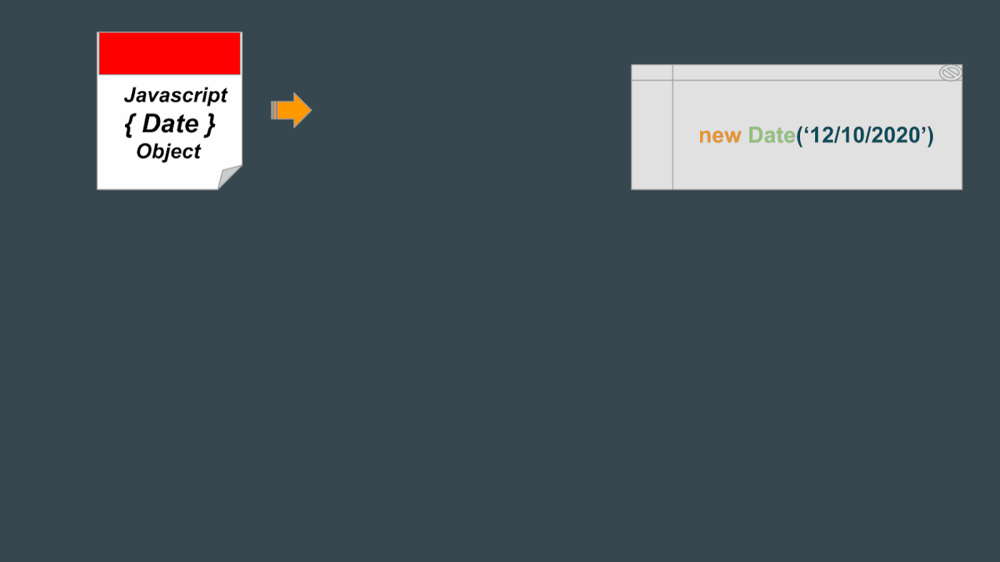

# Дастур барои Конструкторҳои JavaScript

# Ин дастур як шенасоии умумии конструкторҳои маъруфи JavaScript бо мисолҳо, синтаксис ва тасвирҳо аст, ки кӯмак мекунад, ки шумо истифодаи онҳо ва функционалияти онҳоро фаҳмед.

---

## 1. Конструктори Date

# Конструктори `Date` барои эҷоди объекти сана дар JavaScript истифода мешавад. Онро метавонед бо форматҳои гуногун истифода баред, ба монанди санаи мушаххас, санаи имрӯза ё вақти махсус.

### Синтаксис:
```javascript
new Date()
new Date(dateString)
new Date(year, month, day, hours, minutes, seconds, milliseconds)
```

# 2. Конструктори Object
# Конструктори Object барои эҷоди объекти нав истифода мешавад.

# Синтаксис:
```javascript
let obj = new Object();
Мисол:
javascript
Копировать код
let car = new Object();
car.make = "Toyota";
car.model = "Corolla";
car.year = 2005;
console.log(car);
```
# Тасвир:

# 3. Конструктори Array
# Конструктори Array барои эҷоди массивҳо дар JavaScript истифода мешавад.

# Синтаксис:
```javascript
new Array()
new Array(length)
new Array(element1, element2, ..., elementN)
```
# Мисол:
```javascript
let numbers = new Array(10); // Массив бо 10 элементи номаълум
let fruits = new Array("Apple", "Banana", "Orange");
console.log(fruits);
```
# Тасвир:

# 4. Конструктори Function
# Конструктори Function барои эҷоди функсияҳои нав ба таври динамикӣ истифода мешавад. Он метавонад ҳар теъдод параметрҳоро, ки бадан ё мазмуни функсия мешаванд, қабул кунад.

# Синтаксис:
```javascript
new Function(arg1, arg2, ..., functionBody)
```
# Мисол:
```javascript
let add = new Function("a", "b", "return a + b;");
console.log(add(5, 3)); // Натиҷа: 8
```
# Тасвир:

# 5. Конструктори Map
# Конструктори Map барои эҷоди объекти Map истифода мешавад, ки ҷуфтҳои калид-арзишро нигоҳ медорад ва тартиби аслӣ дар вставкаи калидҳоро ёдоварӣ мекунад.

# Синтаксис:
```javascript
new Map()
new Map(iterable)
```
# Мисол:
```javascript
let map = new Map();
map.set('name', 'Alice');
map.set('age', 25);
console.log(map);
```
# Тасвир:

# 6. Конструктори Set
# Конструктори Set барои эҷоди объекти Set истифода мешавад, ки танҳо арзишҳои дурустро дар бар мегирад, ки якхела нестанд.

# Синтаксис:
```javascript
new Set()
new Set(iterable)
```
# Мисол:
```javascript
let set = new Set();
set.add(1);
set.add(2);
set.add(3);
console.log(set);
```
# Хулоса
# Ин дастур конструкторҳои маъруфи JavaScript, аз ҷумла Date, Object, Array, Function, Map ва Set -ро шенасоии мекунад. Фаҳмидани истифодаи ин конструкторҳо кӯмак мекунад, ки шумо кодро ба таври динамикӣ ва самараноктар эҷод кунед.

# Бо ҳамин тамом ташаккури зиёд


# Барои маълумоти бештар гирифтан ба [линки](https://www.canva.com/design/DAGaOluyLCs/cltTI71FktTTBKnMqJ5snw/view?utm_content=DAGaOluyLCs&utm_campaign=designshare&utm_medium=link2&utm_source=uniquelinks&utlId=h4bafa8cb43#7) зерин пахш кунед.